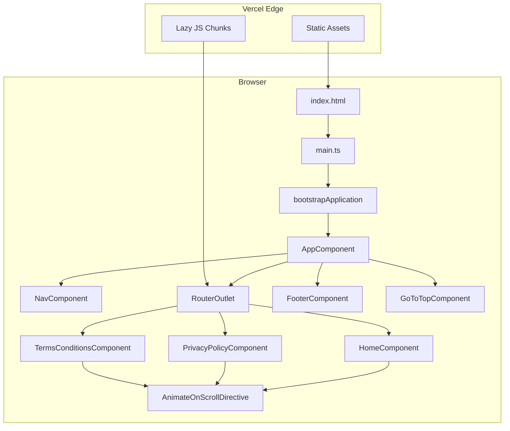
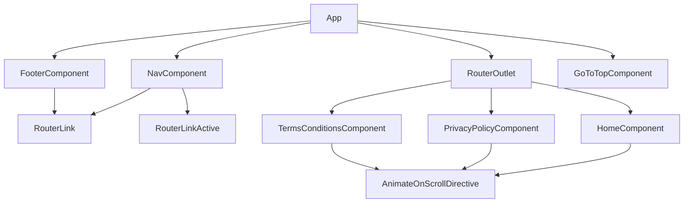
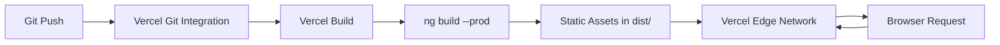

> [!NOTE]
> **Documentation Notice**
>
> This documentation is automatically generated through static analysis of the repository's implementation and existing documentation. It reflects the verified implementation at the time it was generated and is intended as a technical reference for the project's architecture, implementation details, workflows, and engineering decisions.
>
> As the project evolves, portions of this document may become outdated. The repository's source code and LICENSE file remain the authoritative sources for runtime behavior, legal terms, and implementation details.

# Dr.Exam — Marketing Website

**Angular 21 standalone SPA serving as the public-facing site for the Dr.Exam Windows desktop proctoring application. Three lazy-loaded pages, zero backend dependencies, deployed as a static site on Vercel.**

## Purpose

This repository contains the **marketing website** for Dr.Exam, a Windows 11 desktop proctoring application. The site serves as the public front door — it explains the product's capabilities, hosts legal documentation (privacy policy, terms & conditions), and provides a download link to the desktop binary distributed via GitHub Releases. The desktop application source code is **not** included in this repository; only the Angular SPA that markets it.

The intended end users are educational institutions, certification bodies, and organizations that administer proctored remote exams. The marketing site itself has no authentication, no backend, no database, and makes zero network requests — it is a purely static SPA.

## Highlights

- **Fully standalone Angular 21** — zero `NgModule` declarations anywhere in the codebase
- **Zero backend dependency** — no API, no database, no server-side rendering, no environment variables
- **Lazy-loaded routing** — each of the three feature pages is a separate JS chunk delivered on demand
- **Custom CSS design system** — no UI framework; typography, color, and layout are hand-authored with three Google Fonts
- **IntersectionObserver-based scroll animations** — a single reusable directive drives all entrance animations across the site
- **Responsive mobile navigation** — sticky nav collapses to a full-screen animated overlay with staggered link entrance
- **Vercel-deployed static site** — built with the Vite-based `@angular/build:application` builder

## Features

| Feature | Implementation |
|---------|---------------|
| **Hero Section** | Logo, product title, descriptive lede, and a download button linking to a GitHub Release (`v1.0.0/DrExam.zip`). Staggered fade-in-up entrance animation on scroll. |
| **Capabilities Grid** | Six feature cards (Face Detection, Gaze Tracking, Screen Recording, Proctor Dashboard, Offline Mode, Privacy First) with staggered 80ms interval delays. Alternative cards have a red top border (`card-elevated`). |
| **Privacy Policy Page** | Eight-section legal document describing camera access, screen capture, foreground window polling, evidence logging, YOLOv8 object detection, data storage, user control, and contact information. Effective July 25, 2026. |
| **Terms & Conditions Page** | Thirteen-section legal document covering access restriction, license terms, user conduct, disclaimers, liability limitation, and governing law. Effective July 25, 2026. |
| **Responsive Navigation** | Sticky top nav bar with three links. On ≤768px viewports, links collapse behind a full-screen `backdrop-filter: blur(16px)` overlay toggled by a hamburger button. Links animate in with staggered delays (40ms, 80ms, 120ms). |
| **Scroll-to-Top Button** | Fixed-position button (bottom-right) that appears after 200px scroll via `@HostListener('window:scroll')` and smooth-scrolls to top on click. |
| **Scroll-Triggered Animations** | `AnimateOnScrollDirective` applies `will-animate` (hidden + offset) on elements below the viewport and transitions to `is-visible` (shown + reset) at 10% intersection via `IntersectionObserver`. One-shot — observer disconnects after first intersection. |

## Technical Overview

The application is a single Angular 21 SPA bootstrapped via `bootstrapApplication` (no `NgModule`). The root `App` component provides the shell layout — sticky nav, flex-fill `<main>` with `<router-outlet>`, footer, and a floating go-to-top button. Three lazy-loaded routes resolve to standalone feature components; a wildcard route redirects unknown paths to `/`.

The router registers three providers globally: `provideRouter`, `provideAnimations`, and `provideBrowserGlobalErrorListeners`. The `provideAnimations` provider is registered but no Angular animation triggers are used in the templates — all visual transitions are CSS-based (transitions + `IntersectionObserver` class toggling).

The site is fully static. It makes no HTTP requests, consumes no APIs, persists no data, and requires no environment configuration. All content is compiled into the JavaScript bundle at build time.

**Application Lifecycle:**
1. `index.html` is served from Vercel's edge network
2. `main.ts` calls `bootstrapApplication(App, appConfig)`
3. Angular resolves the URL against the route table
4. The matching route's `loadComponent()` fetches the lazy chunk
5. The component renders inside `<router-outlet>` within the shell layout
6. Navigation between pages fetches new lazy chunks without full page reload

## Technology Stack

| Category | Technology | Role |
|----------|-----------|------|
| Language | TypeScript 5.9 | Application logic and component definitions |
| Framework | Angular 21 (`@angular/core`) | Standalone component architecture, DI, lifecycle |
| Routing | `@angular/router` | Client-side SPA routing with lazy `loadComponent` |
| Build System | Vite (via `@angular/build:application`) | Development server, production bundling, CSS processing |
| Package Manager | npm 11.6.2 | Dependency resolution (enforced in `package.json`) |
| Styling | Plain CSS | No CSS preprocessor or utility framework |
| Fonts | Google Fonts (Archivo Black, Work Sans, Space Mono) | Loaded via `<link>` in `index.html` with `preconnect` |
| Animations | CSS transitions + `IntersectionObserver` | Scroll-triggered entrance animations via the `AnimateOnScrollDirective` |
| Testing | Vitest 4.0 | Configured via `@angular/build:unit-test` builder (no test files present) |
| Code Style | Prettier 3.8 | Semicolons, single quotes, trailing commas, 100 print width, 2-space tabs |
| Deployment | Vercel | Static SPA hosting with edge distribution |
| Editor Config | EditorConfig | 2-space indentation, LF line endings, UTF-8 |

## Repository Structure

```
/
├── public/
│   ├── app-icon.png       # Application icon displayed in the hero section
│   └── favicon.ico        # Browser tab favicon
├── src/
│   ├── index.html         # HTML shell — font preconnects, meta tags, <app-root> placeholder
│   ├── main.ts            # Bootstrap entry point — calls bootstrapApplication()
│   ├── styles.css         # Global reset (box-sizing, margin), body base styles, ::selection
│   └── app/
│       ├── app.config.ts  # ApplicationConfig with global providers (router, animations, error listeners)
│       ├── app.routes.ts  # Route table — three lazy routes + wildcard redirect
│       ├── app.ts         # Root component — selector: app-root
│       ├── app.html       # Root template — nav + main/router-outlet + footer + go-to-top
│       ├── app.css        # Root layout — flex column, min-height 100dvh, main flex:1
│       ├── features/
│       │   ├── home/              # Lazy-loaded home page (/)
│       │   │   ├── home.component.ts
│       │   │   ├── home.component.html
│       │   │   └── home.component.css
│       │   ├── privacy-policy/    # Lazy-loaded privacy policy (/privacy-policy)
│       │   │   ├── privacy-policy.component.ts
│       │   │   ├── privacy-policy.component.html
│       │   │   └── privacy-policy.component.css
│       │   └── terms-conditions/  # Lazy-loaded terms & conditions (/terms-conditions)
│       │       ├── terms-conditions.component.ts
│       │       ├── terms-conditions.component.html
│       │       └── terms-conditions.component.css
│       ├── layout/
│       │   ├── nav/           # Sticky top navigation — responsive hamburger overlay
│       │   │   ├── nav.component.ts
│       │   │   ├── nav.component.html
│       │   │   └── nav.component.css
│       │   └── footer/        # Site footer — link row + copyright
│       │       ├── footer.component.ts
│       │       ├── footer.component.html
│       │       └── footer.component.css
│       └── shared/
│           ├── components/
│           │   └── go-to-top.component.ts        # Floating scroll-to-top button (inline template + styles)
│           └── directives/
│               └── animate-on-scroll.directive.ts # IntersectionObserver-based scroll animation
├── angular.json                     # Angular CLI configuration — Vite builder, budgets, test config
├── package.json                     # Project manifest — scripts, dependencies, npm version pin
├── tsconfig.json                    # Base TypeScript config — strict mode, ES2022, bundler resolution
├── tsconfig.app.json                # App compilation config — entry point src/main.ts
├── tsconfig.spec.json               # Test compilation config — vitest/globals types
├── vercel.json                      # Vercel project name mapping
├── .prettierrc                      # Prettier formatting rules
├── .editorconfig                    # Cross-editor coding style settings
├── .gitignore                       # Ignored paths — dist, node_modules, .env, .vercel, IDE files
├── AGENTS.md                        # AI coding agent conventions for this project
└── LICENSE                          # Proprietary license — all rights reserved
```

## Architecture

### System Architecture

The repository contains a single Angular SPA with no external dependencies at runtime.



### Component Dependency Graph



### Request Lifecycle

```
User enters URL
  → Vercel edge serves index.html
  → Browser downloads index.html
  → <script> tags (embedded by Vite build) trigger main.ts
  → bootstrapApplication(App, appConfig)
  → Angular compiles App component eagerly
  → Angular Router parses URL path
  → Router matches route table entry
  → loadComponent() initiates dynamic import of feature chunk
  → Browser fetches lazy JS chunk
  → Angular resolves lazy component class
  → RouterOutlet renders component inside <main>
  → AnimateOnScrollDirective checks viewport position
  → If below viewport: IntersectionObserver watches for scroll intersection
  → On intersection: CSS class toggled, entrance transition fires
  → User clicks nav link
  → Router updates without full page reload
  → Previous lazy component destroyed
  → New lazy component loaded via same loadComponent mechanism
```

### Scroll Animation Flow

```
[animateOnScroll] applied to <section>
  → ngOnInit()
  → getBoundingClientRect() checks viewport position
  → If already in viewport:
      → Add 'is-visible' class immediately (no observer)
  → If below viewport:
      → Add 'will-animate' class (opacity: 0, translateY: 20px)
      → Create IntersectionObserver with threshold 0.1
      → Observe element
      → On intersection event:
          → Remove 'will-animate' class
          → Add 'is-visible' class (opacity: 1, translateY: 0)
          → unobserve() element (one-shot)
  → ngOnDestroy()
      → observer.disconnect()
```

### Initialization Sequence

1. `index.html` loads — three Google Font stylesheets are prefetched via `<link rel="preconnect">` + `crossorigin`
2. Angular runtime bootstraps — `main.ts` calls `bootstrapApplication(App, appConfig)`
3. `appConfig` provides three global providers: `provideRouter(routes)`, `provideAnimations()`, `provideBrowserGlobalErrorListeners()`
4. `App` component instantiates — eagerly imports `NavComponent`, `FooterComponent`, `GoToTopComponent` as direct dependencies
5. Router resolves initial URL — matches against route table
6. Matching route's `loadComponent()` triggers dynamic `import()` — browser fetches the lazy chunk
7. Lazy component renders inside `<router-outlet>` — `AnimateOnScrollDirective` initializes on elements with the attribute

## Core Components

### `App` (`src/app/app.ts`)

**Selector:** `app-root`

**Responsibility:** Application shell. Provides the structural layout — navigation at top, routed content (flex-fill `<main>`) in the middle, footer at bottom, floating go-to-top button.

**Template** (`app.html`): Six lines:
```html
<app-nav />
<main><router-outlet /></main>
<app-footer />
<app-go-to-top />
```

**Dependencies:** `RouterOutlet` (Angular), `NavComponent`, `FooterComponent`, `GoToTopComponent`

**State:** None — stateless component.

**Lifecycle:** Instantiated once at bootstrap, never destroyed during SPA navigation.

### `NavComponent` (`src/app/layout/nav/nav.component.ts`)

**Selector:** `app-nav`

**Responsibility:** Sticky top navigation bar with three links — Home, Privacy Policy, Terms & Conditions.

**State:** `menuOpen: boolean` — controls mobile hamburger menu visibility.

**Behavior:**
- Desktop (>768px): horizontal link row with `RouterLinkActive` highlighting (red `#EF4444` bottom border on active link)
- Mobile (≤768px): hamburger button toggles a full-screen overlay (`position: fixed; inset: 0; background: rgba(10,10,10,0.97); backdrop-filter: blur(16px)`). Links fade in with staggered `transition-delay` (40ms, 80ms, 120ms). Overlay closes on link click, overlay background click, or route change (via `closeMenu()` called in each link's `(click)` handler).
- **Hamburger animation:** Three `<span>` bars — open state rotates top bar `+45deg`, bottom bar `-45deg`, middle bar disappears (`opacity: 0`).

**Edge Cases:**
- Logo (`z-index: 102`) and hamburger button (`z-index: 102`) stay above the overlay (`z-index: 100`)
- `$event.stopPropagation()` on `.nav-links` prevents overlay click from closing the menu when clicking a link

### `FooterComponent` (`src/app/layout/footer/footer.component.ts`)

**Selector:** `app-footer`

**Responsibility:** Site footer with navigation links and copyright notice.

**Layout:**
- Desktop: horizontal flex row of three links + centered copyright
- Mobile (≤768px): 2-column CSS grid layout for links

**State:** None.

### `GoToTopComponent` (`src/app/shared/components/go-to-top.component.ts`)

**Selector:** `app-go-to-top`

**Responsibility:** Fixed-position button that appears when the user scrolls past 200px and smooth-scrolls to the top on click.

**Implementation details:**
- Uses `@HostListener('window:scroll')` to detect scroll position
- `visible: boolean` toggles the `.visible` CSS class (`opacity: 1`, `pointer-events: auto`)
- SVG arrow icon (upward chevron) rendered inline
- Hover state inverts colors (black background, white icon)
- Inline template and inline styles — no separate HTML/CSS files (per the convention that trivial components use inline templates)

**Edge Cases:**
- `pointer-events: none` when hidden prevents invisible button from intercepting clicks
- 200px threshold prevents button from appearing on viewports that don't need scrolling

### `AnimateOnScrollDirective` (`src/app/shared/directives/animate-on-scroll.directive.ts`)

**Selector:** `[animateOnScroll]`

**Responsibility:** Adds scroll-triggered fade-in-up entrance animations to any element.

**Implementation:**
- Injects `ElementRef` via `inject()` and accesses `nativeElement` as `HTMLElement`
- `ngOnInit()` checks initial viewport position via `getBoundingClientRect()`
- Two CSS classes managed:
  - `will-animate`: Applied when element is below viewport — `opacity: 0; transform: translateY(20px)`
  - `is-visible`: Applied when element enters viewport — `opacity: 1; transform: translateY(0)`
- `IntersectionObserver` with `threshold: 0.1` (10% of element visible triggers callback)
- **One-shot design:** After first intersection, the observer calls `unobserve()` to disconnect that element
- If element is already in viewport on init, `is-visible` is applied immediately without creating an observer
- `ngOnDestroy()` calls `observer.disconnect()` to prevent memory leaks

**Consumers:** `HomeComponent` (hero section + features grid section), `PrivacyPolicyComponent` (entire legal page), `TermsConditionsComponent` (entire legal page).

Each consumer's CSS defines its own transition timing and per-child staggered delays — the directive only handles class toggling.

### `HomeComponent` (`src/app/features/home/home.component.ts`)

**Selector:** `app-home`

**Content:**
- **Hero section:** Logo image (259×259px, from `app-icon.png`), title in Archivo Black (56px desktop, 32px mobile), lede paragraph, download button linking to a GitHub Release
- **Capabilities grid:** Six cards in a responsive `auto-fit, minmax(300px, 1fr)` grid. Three cards (Gaze Tracking, Proctor Dashboard, Privacy First) are `card-elevated` with a red top border. Cards have staggered `transition-delay` from 0ms to 400ms at 80ms intervals.

**Scroll animation details:**
- Hero section children (title, lede, actions) each have their own `transition-delay` (0.1s, 0.2s, 0.3s) and initial hidden state
- When parent `.hero` receives `is-visible`, all children transition to visible simultaneously with their respective delays
- Feature cards have individual `transition-delay` inline styles, initial `opacity: 0; transform: translateY(16px)`, and transition when parent `.features-grid` becomes visible

### `PrivacyPolicyComponent` / `TermsConditionsComponent`

Both follow the same structural pattern:
- Section with `[animateOnScroll]` directive
- Container (max-width 720px)
- Overline label (red `#EF4444`), title, effective date
- Legal content with staggered entrance animation — `.legal-content > *` children transition in with 0.15s delay after the parent becomes visible
- Desktop/mobile responsive padding adjustments

**Content distinction:** Privacy Policy has 8 sections covering data access, storage, and user rights. Terms & Conditions has 13 sections covering license restrictions, user conduct, legal disclaimers, and governing law.

## Routing

| Path | Component | Load Strategy | Wildcard |
|------|-----------|--------------|----------|
| `/` | `HomeComponent` | `loadComponent` (lazy) | — |
| `/privacy-policy` | `PrivacyPolicyComponent` | `loadComponent` (lazy) | — |
| `/terms-conditions` | `TermsConditionsComponent` | `loadComponent` (lazy) | — |
| `**` | Redirect to `/` | — | Yes |

All feature routes use `loadComponent` with dynamic `import()`. No eager imports of feature components exist anywhere in the codebase. The wildcard route (`**`) uses `redirectTo: ''` — any unrecognized path is redirected to the home route.

There are no route guards, resolvers, or any other Angular route protections. The application has no protected routes.

## API Documentation

Not applicable. The Angular application consumes no backend APIs. It is a purely static SPA with all content compiled into the JavaScript bundle at build time.

The desktop application (distributed separately) is described in the marketing copy as using:
- **YOLOv8** — on-device face detection and prohibited object detection
- **MediaPipe** — on-device face landmark detection, head pose estimation, and gaze tracking
- **mss** — on-device screen capture for scene-change detection via perceptual hashing (pHash)
- **UIA / DevTools Protocol** — on-device foreground window title polling and browser URL extraction

No API keys, endpoints, authentication tokens, or cloud service configurations are present in this repository.

## Authentication

Not applicable. The Angular application has no authentication system. There are no login forms, no token storage, no session management, no OAuth flows, no Firebase Authentication integration, no route guards, and no protected resources. The site is fully public.

The desktop application (not in this repository) is described as having no cloud dependencies and running entirely on-device, which implies no centralized authentication infrastructure — access control is handled via proprietary distribution rather than runtime authentication.

## Data Model

Not applicable. The Angular application has no database, no persistence layer, no local storage usage, no cookies, and no client-side caching beyond the browser's standard HTTP cache. There are no models, entities, DTOs, schemas, or data access layers anywhere in the codebase.

## Configuration

### `angular.json`

Core build configuration defining the Angular CLI project. Key settings:

- **Builder:** `@angular/build:application` — Vite-based application builder (not the legacy Webpack-based `@angular-devkit/build-angular`)
- **Entry point:** `src/main.ts`
- **Styles entry:** `src/styles.css`
- **Assets:** `public/` directory glob
- **Production budgets:** 500kB warning / 1MB error for initial bundle; 6kB warning / 8kB error for any single component stylesheet
- **Output hashing:** `all` in production (content-hashed filenames for cache busting)
- **Test builder:** `@angular/build:unit-test` (Vitest integration)
- **Default serve configuration:** `development` (no optimization, source maps enabled)

### `tsconfig.json`

Base TypeScript configuration with strict mode enabled. Key settings:

- `target: ES2022`, `module: ES2022`, `moduleResolution: bundler`
- `experimentalDecorators: true` — required by Angular's legacy decorator-based component model
- `strict: true` — enables all strict type-checking options
- Angular compiler options: `strictInjectionParameters`, `strictInputAccessModifiers`, `strictTemplates`

`tsconfig.app.json` extends the base config, sets `src/main.ts` as the entry file, and includes `src/**/*.d.ts`. `tsconfig.spec.json` adds `vitest/globals` types and includes spec files.

### `package.json`

- **Project name:** `dist-drexam`, version `0.0.1`
- **Private:** `true` — prevents accidental `npm publish`
- **Package manager:** npm 11.6.2 (enforced)
- **Scripts:** `ng` (CLI passthrough), `start` → `ng serve`, `build` → `ng build`, `watch` → `ng build --watch --configuration development`, `test` → `ng test`

### `vercel.json`

Minimal Vercel configuration — only sets the project name to `drexam`. No rewrites, redirects, headers, or functions configured. Vercel's static SPA defaults serve `index.html` for all routes.

### `.prettierrc`

Formatting configuration: semicolons enabled, single quotes, trailing commas where valid, 100 print width, 2-space tabs.

### `.editorconfig`

Cross-editor settings: 2-space indentation, LF line endings, UTF-8 charset, trailing whitespace trimmed, final newline inserted.

### `AGENTS.md`

Project-specific conventions for AI coding agents. Defines the architecture rules (standalone components, lazy loading, `features/`/`layout/`/`shared/` folder structure), coding conventions (`input()`/`output()` over decorators, `inject()` over constructor injection), naming conventions (kebab-case folders, `app-` component prefix), asset conventions (public/ directory), and design system tokens (fonts, colors, radii, shadows).

## Environment Variables

**None.** The Angular application has no environment variable configuration. No `.env` files, no Angular environment files (`src/environments/`), no `DefinePlugin` substitutions, and no runtime configuration are present. The `.gitignore` excludes `.env`, `.env.local`, and `.env.*.local` as a general best practice rather than because the project uses them.

## Dependencies

### Production

| Package | Version | Purpose |
|---------|---------|---------|
| `@angular/core` | ^21.2.0 | Angular framework runtime — component model, DI, lifecycle, signals |
| `@angular/router` | ^21.2.0 | Client-side SPA routing with lazy `loadComponent` |
| `@angular/platform-browser` | ^21.2.0 | Browser platform bootstrap via `bootstrapApplication` |
| `@angular/animations` | ^21.2.18 | Animation module provider (registered in `appConfig` but no animation triggers used in templates) |
| `@angular/forms` | ^21.2.0 | Forms module (included as a dependency but never imported or used in any component) |
| `@angular/common` | ^21.2.0 | Common directives and pipes (used indirectly through Angular runtime) |
| `@angular/compiler` | ^21.2.0 | Angular template compiler (used at build time, not runtime) |
| `rxjs` | ~7.8.0 | Reactive Extensions library (used internally by Angular) |
| `tslib` | ^2.3.0 | TypeScript helper functions for emitted `__awaiter`, `__decorate`, etc. |

### Development

| Package | Version | Purpose |
|---------|---------|---------|
| `@angular/cli` | ^21.2.13 | Angular CLI — `ng serve`, `ng build`, `ng test`, `ng generate` |
| `@angular/build` | ^21.2.13 | Vite-based build system — application builder and dev-server |
| `@angular/compiler-cli` | ^21.2.0 | Angular AOT compiler and template type-checking |
| `typescript` | ~5.9.2 | TypeScript language compiler |
| `vitest` | ^4.0.8 | Unit test framework (configured via `@angular/build:unit-test` builder) |
| `jsdom` | ^28.0.0 | DOM environment for Vitest (required for Angular component test rendering) |
| `prettier` | ^3.8.1 | Code formatter |

## Application Workflow

### Bootstrap and Initial Render

```
1. Browser requests URL → Vercel edge serves index.html
2. index.html loads:
   a. <base href="/"> sets relative URL base
   b. Google Fonts stylesheets requested (Archivo Black, Work Sans 400/500/600/700, Space Mono)
   c. <app-root></app-root> placeholder rendered
3. Angular scripts (embedded by Vite build) execute
4. main.ts calls bootstrapApplication(App, appConfig)
5. appConfig registers:
   a. provideBrowserGlobalErrorListeners() — catches window.onerror and unhandledrejection
   b. provideRouter(routes) — initializes Router with route table
   c. provideAnimations() — registers animation module (not actively used by templates)
6. Angular compiles App component:
   a. Creates NavComponent, FooterComponent, GoToTopComponent eagerly
   b. Creates <router-outlet> directive
7. Router resolves initial URL against routes
8. loadComponent() triggers dynamic import() for the matching feature chunk
9. Browser fetches lazy chunk (e.g., home.component.js)
10. Angular resolves the component class and renders it inside <router-outlet>
11. AnimateOnScrollDirective.ngOnInit() fires:
    a. Checks if element is already in viewport
    b. If not visible: adds 'will-animate', creates IntersectionObserver
    c. If visible: adds 'is-visible' immediately
12. Page is fully rendered and interactive
```

### Navigation Lifecycle

```
1. User clicks nav link (e.g., /privacy-policy)
2. Router intercepts click (no full page reload)
3. Current lazy component's ngOnDestroy fires:
   a. AnimateOnScrollDirective disconnects IntersectionObserver
4. Router fetches new lazy chunk via dynamic import
5. New component initializes:
   a. ngOnInit fires for all directives
   b. AnimateOnScrollDirective re-checks viewport
   c. New page renders in <router-outlet>
6. URL updates in browser address bar
7. Browser history entry pushed
```

### Scroll Animation Activation

```
1. User scrolls down the page
2. IntersectionObserver callback fires when element reaches 10% visibility threshold
3. Callback executes:
   a. this.el.classList.remove('will-animate')
   b. this.el.classList.add('is-visible')
   c. this.observer.unobserve(this.el)
4. CSS transition triggers:
   a. Element transitions from opacity: 0, translateY(20px) → opacity: 1, translateY(0)
   b. Transition: 0.4s cubic-bezier(0.16, 1, 0.3, 1) (ease-out-expo-like curve)
5. If element has children with staggered delays (e.g., .hero-title, .hero-lede, .hero-actions):
   a. Each child transitions independently at its configured delay
   b. Cards in features grid transition with 80ms staggered intervals
```

### Scroll-to-Top Activation

```
1. User scrolls past 200px
2. window:scroll event fires
3. GoToTopComponent.onScroll() checks window.scrollY > 200
4. Sets this.visible = true
5. Angular updates [class.visible] binding
6. CSS transitions button from opacity: 0 → 1, translateY(12px) → 0, pointer-events: none → auto
7. User clicks button
8. scrollToTop() calls window.scrollTo({ top: 0, behavior: 'smooth' })
9. Scroll position resets to top
10. GoToTopComponent.visible becomes false
11. Button fades out
```

## Performance Considerations

- **Lazy loading:** All feature pages are loaded on demand via `loadComponent`. The initial bundle contains only the shell layout (App, Nav, Footer, GoToTop, AnimateOnScroll) and the router.
- **Production budgets:** Angular build enforces 500kB initial bundle warning / 1MB error threshold and 6kB per-component style warning / 8kB error threshold.
- **Content hashing:** Production builds use `outputHashing: "all"` — all output filenames include content hashes for aggressive CDN caching.
- **No unused Angular features:** Although `@angular/forms` is listed as a dependency and `provideAnimations()` is registered, neither forms nor Angular animation triggers are used in templates — the imports are vestigial and do not affect bundle size at runtime in tree-shaking builds.
- **One-shot IntersectionObserver:** The `AnimateOnScrollDirective` calls `unobserve()` after the first intersection, preventing unnecessary scroll observation overhead.
- **No runtime data fetching:** Zero HTTP requests are made at runtime. All content is compiled into the JavaScript bundle.
- **preconnect hints:** `index.html` includes `<link rel="preconnect">` for `fonts.googleapis.com` and `fonts.gstatic.com` to reduce font loading latency.

## Security Considerations

- **No authentication infrastructure** — zero attack surface for credential theft, session hijacking, or token leakage.
- **No backend API** — zero server-side attack surface, no injection vectors, no database, no server-side processing.
- **No environment variables** — no secrets, API keys, or credentials are stored or loaded at any point.
- **No third-party scripts** — no analytics, telemetry, tracking, advertising, or external JavaScript dependencies. The only external resources are Google Fonts stylesheets.
- **Strict TypeScript configuration** — `strict: true`, `noImplicitOverride`, `noPropertyAccessFromIndexSignature`, `noImplicitReturns`, `noFallthroughCasesInSwitch` enabled. Angular compiler runs with `strictTemplates`, `strictInjectionParameters`, `strictInputAccessModifiers`.
- **Private package** — `package.json` has `"private": true` preventing accidental publishing to npm.
- **Proprietary license** — all rights reserved. No permissions granted for copying, modification, redistribution, reverse engineering, or commercial exploitation.
- **No file uploads** — no user-submitted content, no file processing, no XSS vectors from external input.
- **No cookies or storage** — the application sets no cookies, uses no localStorage, no sessionStorage, no IndexedDB, and no client-side persistence mechanisms.

## Deployment Architecture



- **Hosting:** Vercel global edge network. The project name `drexam` is configured in `vercel.json`.
- **Build:** Angular's Vite-based application builder (`@angular/build:application`) produces a fully static output in `dist/`.
- **Serving:** Vercel's default static SPA configuration serves `index.html` for all routes, letting Angular Router handle client-side navigation.
- **No server-side rendering, no edge functions, no rewrites, no redirects configured beyond Vercel defaults.**
- **No custom domain configuration present in the repository** — domain binding is configured on the Vercel dashboard side.

## CI/CD

Not detected in implementation. No GitHub Actions workflows, no GitLab CI pipelines, no CircleCI configuration, or any other CI/CD automation files exist in the repository. Deployment is assumed to be handled through Vercel's automatic Git integration (branch push triggers build + deploy).

## Engineering Decisions

### Standalone Components Only (No NgModules)

The entire codebase uses Angular's standalone component architecture — zero `NgModule` declarations. This aligns with Angular's direction starting in v14 (standalone components) and the removal of `NgModule` necessity in v15+. It reduces boilerplate, eliminates the mental overhead of module organization, and simplifies lazy loading via `loadComponent`.

### Vite-Based Build System

The project uses `@angular/build:application` (Vite-based) instead of the legacy `@angular-devkit/build-angular` (Webpack-based). Vite offers significantly faster development server startup (native ESM, no bundling in dev) and faster production builds via Rollup. Angular's application builder was stabilized in v17 and became the default in v18.

### CSS-Only Design System (No UI Framework)

All styling is hand-authored CSS with no dependency on Angular Material, Tailwind, Bootstrap, or any UI component library. This keeps the bundle minimal (no CSS framework overhead) and gives complete control over the visual identity. The design is intentional: sharp (`border-radius: 0`), high-contrast (black/white with red accent), with hierarchy established through typography weight and spacing rather than shadows.

### IntersectionObserver Over Angular Animations

Although `provideAnimations()` is registered, no Angular animation triggers (`[@trigger]`) are used. Instead, scroll-triggered entrance animations are implemented via `IntersectionObserver` (for intersection detection) + CSS transitions (for the actual animation). This avoids Angular's animation package overhead at runtime and keeps the animation logic simple and portable.

### Three Separate Lazy Chunks (One Per Page)

Each of the three pages is a separate lazy chunk, even though the total site is tiny. This is an architectural convention (documented in `AGENTS.md`) rather than a necessity — it ensures the pattern scales to larger sites and prevents any single chunk from becoming a bottleneck.

### No Environment Variables

The application has zero environment variable configuration. Since the site is fully static with no API calls, no feature flags, no backend URL to configure, no environment-specific behavior exists. This eliminates an entire class of configuration bugs and simplifies the build pipeline.

## Interesting Implementation Details

### Staggered Cascade Animation Pattern

The home page implements a staggered card entrance where six feature cards animate in with 80ms sequential delays (0ms, 80ms, 160ms, 240ms, 320ms, 400ms). This is achieved entirely through CSS (`transition-delay` inline styles) combined with the parent's `IntersectionObserver`-driven `is-visible` class toggle. No JavaScript animation libraries, no Angular animation triggers, and no requestAnimationFrame loops are needed.

### Conditional Observer Creation

The `AnimateOnScrollDirective` optimizes by checking `getBoundingClientRect()` on initialization. If the element is already in the viewport, no `IntersectionObserver` is created — `is-visible` is applied synchronously. This prevents unnecessary observer overhead for elements visible at page load (e.g., the hero section on a short page).

### Hamburger-to-Overlay Transition

The mobile navigation uses a full-screen overlay with `backdrop-filter: blur(16px)` for a frosted-glass effect. Links within the overlay have individual `transition-delay` values (40ms, 80ms, 120ms) for a sequential reveal. The overlay closes via three mechanisms: link click, overlay background click, or route change. The `$event.stopPropagation()` on the links prevents overlay background clicks from closing before the link click registers.

### Design System Constraints Enforced in AGENTS.md

The project includes an `AGENTS.md` file that encodes design system rules for AI coding agents: "Red is a scalpel — at most one red element per viewport" and "Shadows: none — hierarchy from weight, contrast, and borders only." These constraints are enforced through the project's CSS (only the active nav link and legal page overlines use red; no `box-shadow` anywhere in the codebase).

## License

**Proprietary.** All rights reserved. See [LICENSE](LICENSE) for details.

Copyright (c) 2026 Babariya Meet. No permission is granted to use, copy, modify, merge, publish, distribute, sublicense, create derivative works from, reference, reverse engineer for replication, or otherwise exploit this project, in whole or in part, for any purpose without prior written permission from the copyright holder.
